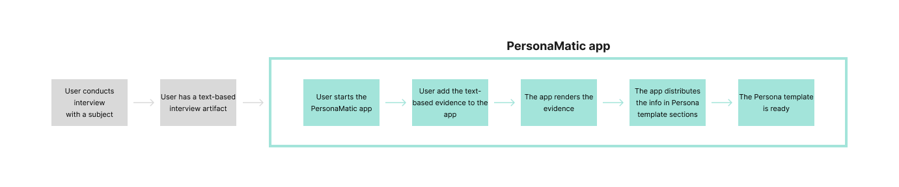

# PersonaMatic: User Persona generator with Flask, OpenAI and Bootstrap integration

A Flask-based web application integrating the OpenAI API for content processing and a responsive front-end powered by Bootstrap. This project serves as a starter template for building AI-powered web apps with a clean and responsive UI.

---

## Features

- **Flask Backend**: Handles API requests, routes, and data processing.
- **OpenAI Integration**: Uses the OpenAI API to process input data and generate AI responses.
- **Bootstrap Front-End**: Provides a sleek, responsive user interface.

---

## Requirements

Ensure you have the following installed:
- Python 3.8 or higher
- Pip (Python package manager)

---

## Installation

1. **Clone the Repository**

   ```bash
   git clone git@github.com:salvisare/PersonaMatic.git

2. **Set Up a Virtual Environment**

   ```bash
   python3 -m venv venv
   source venv/bin/activate  # On Windows: venv\Scripts\activate
   
3. **Install Dependencies**

   ```bash
   pip install -r requirements.txt

4. **Add OpenAI API Key**

   ```bash
   OPENAI_API_KEY=your_openai_api_key

5. **Run the Application**

   ```bash
   flask run

6. **View in Browser**
   Open http://127.0.0.1:5000 in your web browser.

---

## Concept


---

## DB Diagram


---

## Screenshots
* tbc

---

## Tech Stack
* Backend: Flask (Python)
* AI Integration: OpenAI API
* Front-End Framework: Bootstrap 5
* Environment Management: Python venv and .env files

---

## Contributing
1. Fork the repository.
2. Create a feature branch (git checkout -b feature-branch).
3. Commit your changes (git commit -am 'Add new feature').
4. Push to the branch (git push origin feature-branch).
5. Open a Pull Request.

---

## Acknowledgments
* OpenAI API Documentation (https://platform.openai.com/docs/overview)
* Flask Documentation (https://flask.palletsprojects.com/en/stable/)
* Bootstrap Documentation (https://getbootstrap.com/)