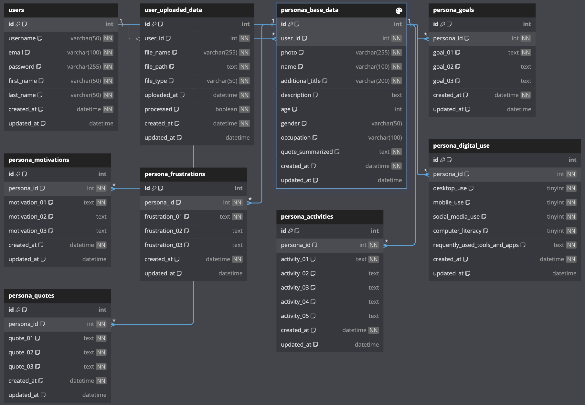
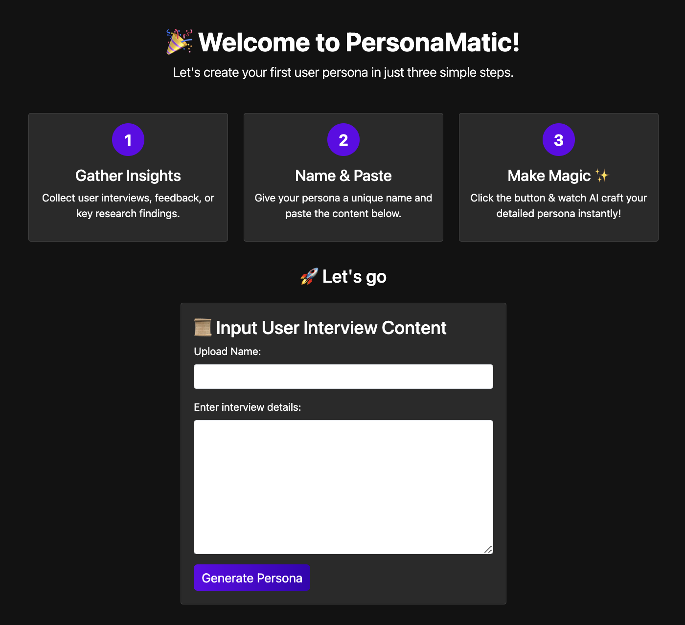
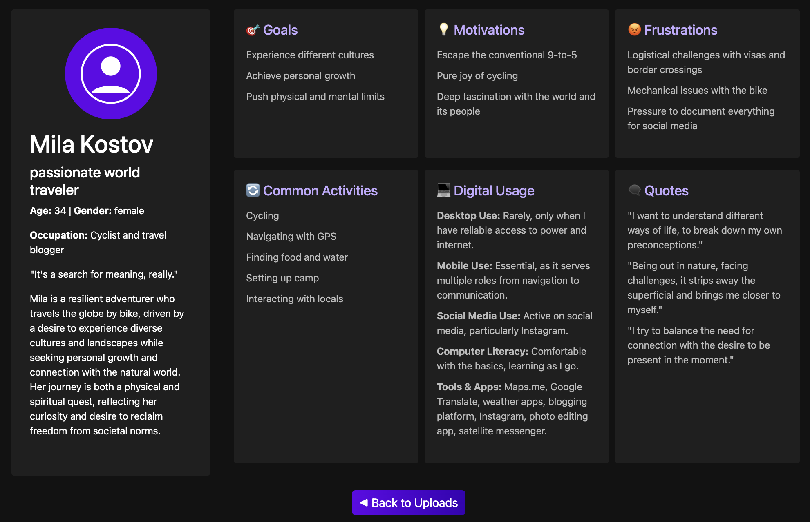

# PersonaMatic: User Persona generator

PersonaMatic is an AI-powered tool that automates user persona generation based on user interview content. Save time and enhance UX research with detailed and structured personas.

A Flask-based web application integrating the OpenAI API for content processing and a responsive front-end powered by Bootstrap. This project serves as a starter template for building AI-powered web apps with a clean and responsive UI.

---

## Features

- **Flask Backend**: Handles API requests, routes, and data processing.
- **OpenAI Integration**: Uses the OpenAI API to process input data and generate AI responses.
- **Bootstrap Front-End**: Provides a sleek, responsive user interface.

---

## Requirements

Ensure you have the following installed:
- Python 3.8 or higher
- Pip (Python package manager)

---

## 🚀 Installation Guide

### 1️⃣ Clone the Repository

```bash
git clone git@github.com:salvisare/PersonaMatic.git
cd PersonaMatic
```

### 2️⃣ Set Up a Virtual Environment

```bash
python3 -m venv venv
source venv/bin/activate  # On Windows: venv\Scripts\activate
```

### 3️⃣ Install Dependencies

```bash
pip install -r requirements.txt
```

### 4️⃣ Configure API & Session Key

Create a `.env` file in the root directory and add:

```bash
OPENAI_API_KEY=your_openai_api_key
SESSION_SECRET_KEY=your_secure_random_key
```

#### 🔑 Generate a secure session key using:
```python
import secrets
print(secrets.token_hex(32))
```

### 5️⃣ Run the Application

```bash
flask run
```

### 6️⃣ View in Browser
Open [http://127.0.0.1:5000](http://127.0.0.1:5000) in your web browser.

---

### ✅ Notes:
- Ensure that your `.env` file is properly configured before running the application.
- If you face permission issues on Windows, use `Set-ExecutionPolicy Unrestricted -Scope Process` before activating the virtual environment.
- Use `deactivate` to exit the virtual environment when done.

---

## Concept


---

## DB Diagram


---

## Screenshots
Home screen:

Initial upload screen:

Uploads management screen:

Generatet Persona screen:


---

## Tech Stack
* Backend: Flask (Python)
* AI Integration: OpenAI API
* Front-End Framework: Bootstrap 5
* Environment Management: Python venv and .env files

---

## Contributing
1. Fork the repository.
2. Create a feature branch (git checkout -b feature-branch).
3. Commit your changes (git commit -am 'Add new feature').
4. Push to the branch (git push origin feature-branch).
5. Open a Pull Request.

---

## Acknowledgments
* OpenAI API Documentation (https://platform.openai.com/docs/overview)
* Flask Documentation (https://flask.palletsprojects.com/en/stable/)
* Bootstrap Documentation (https://getbootstrap.com/)